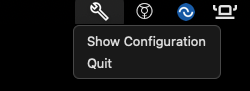
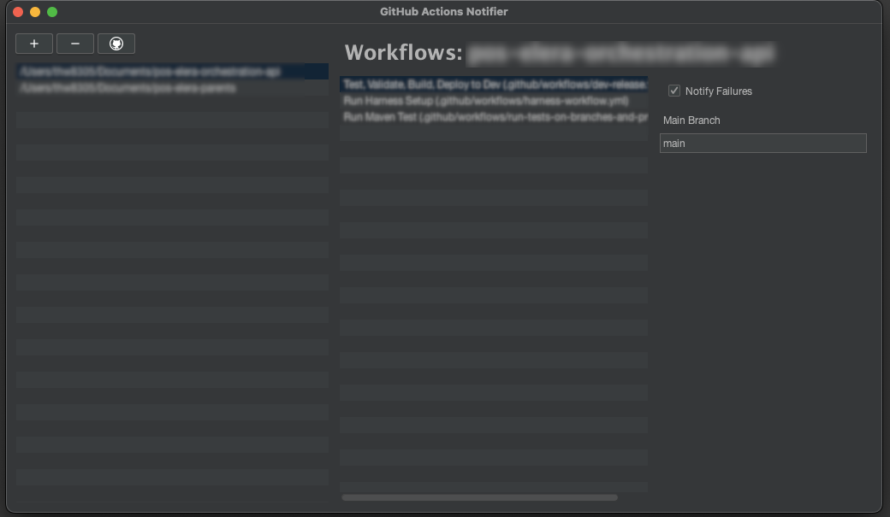

GHA Notifier
============

[](https://github.com/atl-tw/gha-notifier/actions/workflows/main.yaml)

Purpose
-------

If you work in a large enterprise, there is a good chance the IT department has blocked using third party applications
with your GitHub account, but you still want to receive notifications when a GitHub Action fails. 

This application is a system tray notifier that delegates to the GitHub CLI to poll the state of your GitHub Actions.

Installation
------------

With homebrew Mac:

```bash
brew tap atl-tw/tap
brew install --cask gha-notifier
# enter password to authorize unsigned application
```

For others, see the releases page for binaries.

Usage
-----

The application will start and load to the system tray.



You may be prompted to locate the `gh` executable. You can download it from [here](https://cli.github.com/). Once
installed click the GitHub icon on the configuration screen to select it.



Once you have done this, you can add or remove repositories by clicking the `+` or `-` buttons. After they are added
you can select them and view the workflows for each repository. If you would like notification for a workflow, 
click the "Notify Failures" checkbox. If the branch you want to monitor is not `main` you can enter it in the 
`Main Branch` field.


Made in Georgia


